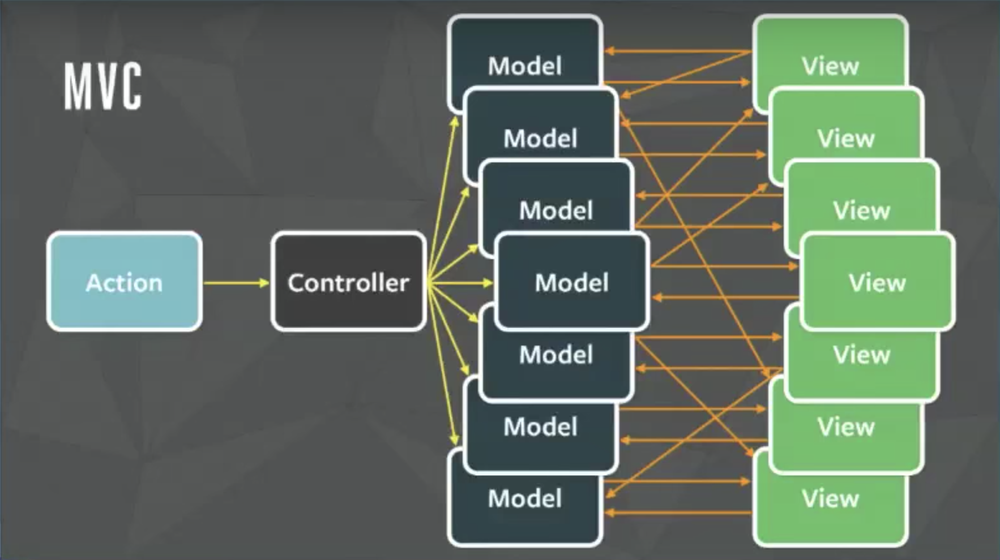
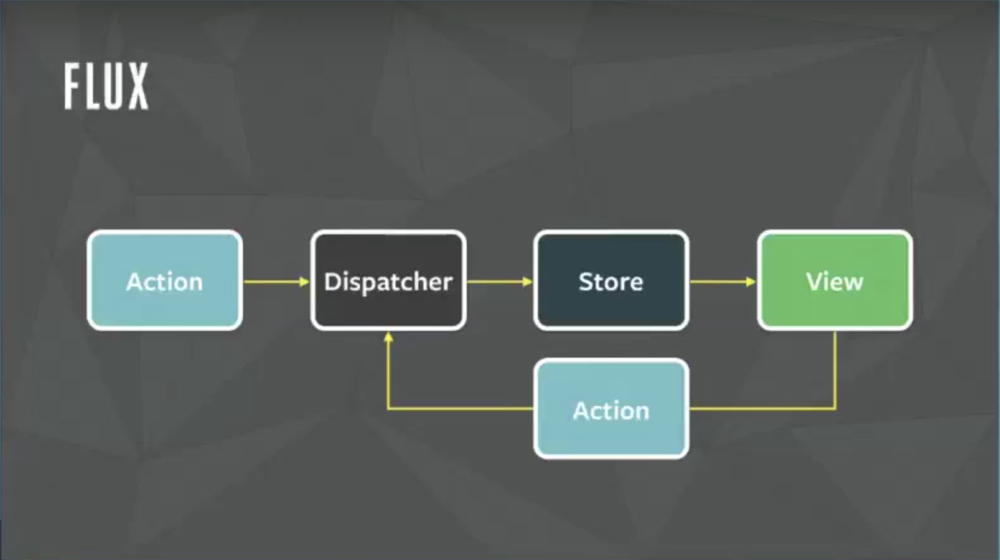
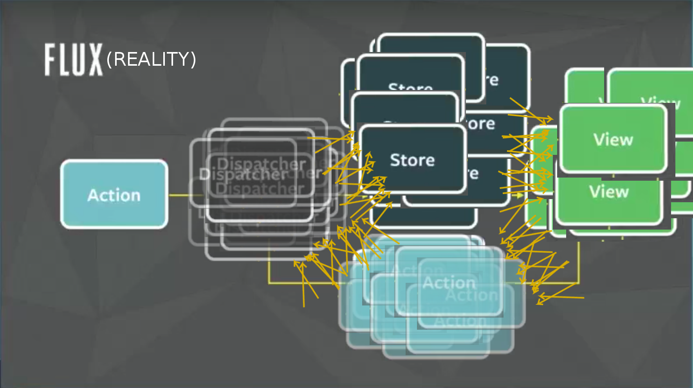
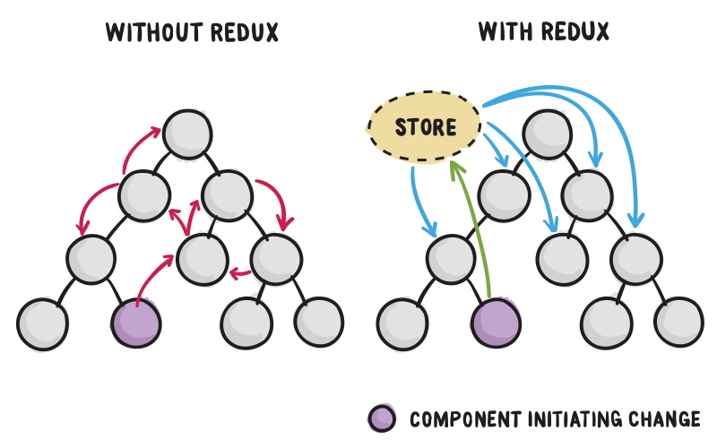

# Redux


### Архитектура Flux
<div class="flex">
    <div style="width: 50%">
        
    </div>
    <div>
        
    </div>
</div>


### Flux (реальность)




### Redux
 - *реализация* архитектуры Flux
 - единое хранилище состояния для всего приложения
 - иммутабельные структуры данных
 - unidirectional data-flow (flux)
 - hot reloading
 - time traveling (**!!**)


### Redux
 - крайне мал (~100-200 строчек кода)
 - 9 методов в API
 - легче написать чем понять *как правильно использовать*

<div style="width: 40%; margin: auto;">
    
</div>


### Redux: терминология и API
 - Store - единственный иммутабельный объект-дерево состояния
 - Action - обычный JS-объект, описывающий происходящее
 - Action Creator - функция, возвращающая Action
 - Reducer - чистая функция вида `(state, action) => newState`
 - `createStore(reducer, [initState], [enhancer])` - создать Store
 - `Store::getState()` - получить текущее дерево состояния
 - `Store::subscribe(listener)` - подписаться на изменение состояния
 - `Store::dispatch(action)` - обработать `action` с помощью `reducer` и получить новое состояние


### Простой пример

<div class="flex">
<pre><code class="javascript" data-trim data-noescape>
// type - обязательное поле в action
const action1 = { type: "INCREMENT" };
const action2 = { type: "DECREMENT" };
const action3 = {
  type: "INCREASE",
  value: 5
};

const reducer = (state = 0, action) => {
  switch (action.type) {
    case "INCREMENT":
      return state + 1;
    case "DECREMENT":
      return state - 1;
    case "INCREASE":
      return state + action.value;
    default:
      // Важно возвращать текущий state
      // в default-ветке, если ни один
      // action не сработал
      return state;
  }
};
</code></pre>
<pre><code class="javascript" data-trim data-noescape>
import { createStore } from "redux";
const store = createStore(reducer);

store.getState(); // -> 0

store.dispatch(action1);
store.getState(); // -> 1

store.dispatch(action2);
store.getState(); // -> 0

store.dispatch(action3);
store.getState(); // -> 5

// default ветка
store.dispatch({ type: "UNKNOWN" });
store.getState(); // -> 5
</code></pre>
</div>


### Пример посложней

<div class="flex">
<pre><code class="javascript" data-trim data-noescape>
const ADD_TODO = "ADD_TODO";
const REMOVE_TODO = "REMOVE_TODO";

// Action Creator может содержать логику
const addTodo = (msg) => ({
    type: ADD_TODO,
    todo: { id: getUniqueId(), msg }
});
const removeTodo = (id) => ({
    type: REMOVE_TODO, id
});

const reducer = (state = [], action) => {
    switch (action.type) {
        case ADD_TODO:
            // И - Иммутабельность!
            return [...state, action.todo];
        case REMOVE_TODO:
            // И - Опять иммутабельность!
            return state.filter(todo =>
                todo.id !== action.id);
        default:
            return state;
    }
};
</code></pre>
<pre><code class="javascript" data-trim data-noescape>
import { createStore } from "redux";
const store = createStore(reducer);

store.getState(); // -> []
store.subscribe(() => {
    console.log(store.getState());
});

store.dispatch(addTodo("Hello"));
// -> [{ id: 0, msg: "Hello" }]

store.dispatch(addTodo("World"));
// -> [{id: 0, msg: "Hello"},
//     {id: 1, msg: "World"}]

store.dispatch(removeTodo(0));
// -> [{id: 1, msg: "World"}]
</code></pre>
</div>


### Почему иммутабельность так важна?
 - Чтобы отследить изменения в объекте, нужно сравнить его состояние "до" и "после"
 - Изменяемые объекты: должны проверить все поля по очереди
 - Неизменяемые объекты: сам объект является "токеном" версии

<div class="flex">
<pre><code class="javascript" data-trim data-noescape>
// Изменяемый объект
let obj = { ... };
let prevObj = Object.assign({}, obj);

// 100500 строчек кода,
// где obj мог измениться
obj.x = "new val"; // например так

// Как проверить что obj был изменен?
// только рекурсивным обходом в глубину
deepEquals(obj, prevObj);
</code></pre>
<pre><code class="javascript" data-trim data-noescape>
// Неизменяемый объект
let obj = { ... };
let prevObj = obj;

// 100500 строчек кода,
// где obj мог измениться
obj = Object.assign({},
        obj, {x: "new value"});
obj = { ...obj, x: "new value" };

// obj изменился по сравнению с prevObj?
a === prevA; // Изи!
</code></pre>
</div>


### Редьюсеры. Редьюсеры повсюду.
 - Реальное state tree состоит из десятков и сотен полей
 - Невозможно написать один редьюсер для всего дерева
 - `Redux.combineReducers()` комбинирует несколько редьюсеров в один

```javascript
const todos = (state = [], action) { . . . }    // Редьюсер списка todos
const counter = (state = 0, action) { . . . }   // Редьюсер поля filter
const settings = (state = {}, action) { . . . } // Редьюсер объекта settings

// Скомпонуем редьюсеры вручную
const reducer1 = (state = {}, action) => ({
    todos: todos(state.todos, action),
    counter: counter(state.counter, action),
    settings: settings(state.settings, action)
};

// Именно это делает combineReducers:
import { combineReducers } from "redux";
const reducer2 = combineReducers({ todos, counter, settings });
```


### Middleware: Where The Side Effects Are
 - Как нам сделать логирование/error reporting?
 - Как обрабатывать асинхронные действия?
 - Где поместить дополнительную логику?
 - Middleware: вызывается между `store.dispatch` и редьюсерами

```javascript
const logger = function(store) { // К - Каррирование!
  return function(next) {
    return function(action) {
      console.log(action.type);
      return next(action);
    }
  }
}

const logger2 = store => next => action => {
  if (action.error) console.error(action.error);
  return next(action);
}

const store = createStore(reducer, Redux.applyMiddleware(logger, logger2))
```


### Acynchronous Action Creators
 - Обычный Action Creator должен возвращать action
 - Стандартное применение: `store.dispatch(actionCreator())`
 - Соглашение: если Action Creator возвращает функцию, то middleware вызывает эту функцию (модуль `redux-thunk`)

```javascript
function getData(id) { // id => (dispatch, getState) => ...
    return function(dispatch, getState) {
        dispatch({type: DATA_REQUEST});
        
        return window.fetch(`blahblah/${id}`)
            .then(data => {
                dispatch({ type: DATA_RECEIVED, data });
            })
            .catch(e => {
                dispatch({ type: DATA_ERROR, error: e.message });
            });
    }
}

store.dispatch(getData(1)); // -> Promise
```


### Зачем React'у Redux
 - Хранить общее для нескольких компонентов состояние в React очень неудобно
 - Redux выступает как хранилище состояния для всего приложения




### Подключение Redux к React

<div class="flex">
<pre><code class="javascript" data-trim data-noescape>
const DECREASE = "DECREASE";
const INCREASE = "INCREASE";

const incr = () => ({ type: INCREASE });
const decr = () => ({ type: DECREASE });

const counter = (state = 0, action) => {
  if (action.type === INCREASE) {
      return state + 1;
  }
  if (action.type === DECREASE) {
      return state - 1;
  }
  return state;
};

const store = createStore(
    combineReducers({ counter }));
</code></pre>
<pre><code class="javascript" data-trim data-noescape>
class Counter extends React.Component {
  componentDidMount () {
    this.props.store.subscribe(
        () => this.forceUpdate());
  }
  decr: () => {
    this.props.store.dispatch(decr());
  }
  incr: () => {
    this.props.store.dispatch(incr());
  }
  
  render() {
    return (
      &lt;div&gt;
        {this.props.store.getState().counter}
        &lt;button onClick={this.incr}&gt;+&lt;/button&gt;
        &lt;button onClick={this.decr}&gt;-&lt;/button&gt;
      &lt;/div&gt;
    );
  }
}

&lt;Counter store={store} /&gt;
</code></pre>
</div>


### react-redux
 - Неудобно передавать ссылку на `store` во все 100500 компонентов приложения
 - Неудобно доставать данные из хранилища `this.props.store.getState().x`
 - Неудобно отправлять изменения через отдельные методы и `store.dispatch`
 - Эти задачи решает пакет `react-redux`


### react-redux
 - `react-redux` оборачивает компонент в специальный компонент-обертку
 - Ссылка на `store` передается через механизм React Context
 - Обертка предоставляет внутреннему компоненту нужные данные и действия через `props`
 - Компонент при этом полностью независим от `store` 

```javascript
import { Provider, connect } from "react-redux";

const WrappedCounter = connect()(Counter);
// Обычно компонент находится в отдельном файле, поэтому можно сделать просто
// export default connect()(Counter);

<Provider store={store}>
  <WrappedCounter />
</Provider>
```


### react-redux: `mapStateToProps`
 - Маппинг данных из хранилища в `props` компонента
 - Получает текущее состояние хранилища
 - Возвращает объект, которым `connect` дополнит `props` обернутого компонента

```javascript
class Counter extends React.Component {
    . . .
    render() {
        return (<div>{this.props.counter}</div>);
    }
};

const mapStateToProps = state => ({
    counter: state.counter
});

export default connect(mapStateToProps)(Counter);
```


### react-redux: `mapDispatchToProps`
 - Функция, получает ссылку на метод `dispatch` хранилища
 - Возвращает объект с функциями-действиями, которым `connect` дополнит `props` обернутого компонента

```javascript
class Counter extends React.Component {
    . . .
    render() {
        return <div>
                {this.props.counter}
                <button onClick={this.props.incr}>+</button>
                <button onClick={this.props.decr}>-</button>
            </div>;
    }
};

const mapStateToProps = state => ({ counter: state.counter });
const mapDispatchToProps = dispatch => ({
    incr: () => dispatch(incr()),
    decr: () => dispatch(decr())
});

export default connect(mapStateToProps, mapDispatchToProps)(Counter);
```


### Итоги подведем

<div class="flex">
<pre><code class="javascript" data-trim data-noescape>
class Counter extends React.Component {
  componentDidMount () {
    this.<mark>props.store</mark>.subscribe(
        () => this.forceUpdate());
  }
  decr: () => {
    this.<mark>props.store</mark>.dispatch(decr());
  }
  incr: () => {
    this.<mark>props.store</mark>.dispatch(incr());
  }
  
  render() {
    const { store } = this.props;
    return (
      &lt;div&gt;
        {<mark>store.getState()</mark>.counter}
        &lt;button
            onClick={this.incr}&gt;+&lt;/button&gt;
        &lt;button
            onClick={this.decr}&gt;-&lt;/button&gt;
      &lt;/div&gt;
    );
  }
}
</code></pre>
<pre><code class="javascript" data-trim data-noescape>
class Counter extends React.Component {
  render() {
    return (
      &lt;div&gt;
        {this.<mark>props</mark>.counter}
        &lt;button
            onClick={this.<mark>props</mark>.incr}&gt;+&lt;/button&gt;
        &lt;button
            onClick={this.<mark>props</mark>.decr}&gt;-&lt;/button&gt;
      &lt;/div&gt;
    );
  }
}
const mapStateToProps = state => ({
    counter: state.counter
});
const mapDispatchToProps = dispatch => ({
    incr: () => dispatch(incr()),
    decr: () => dispatch(decr())
});

export default connect(
    mapStateToProps, mapDispatchToProps
)(Counter);
</code></pre>
</div>