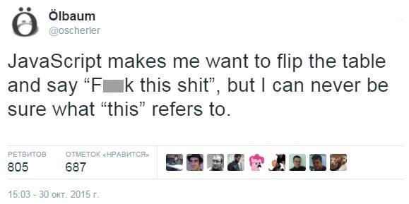

# Функции


### Объявление функций: declaration vs expression

<div class="flex">
<div>
  <h3>Function Declaration</h3>
  <ul>
    <li>Иструкция-объявление</li>
    <li>В основном потоке кода</li>
    <li>Всплывает (hoisting)</li>
  </ul>

  <pre><code class="javascript" data-trim data-noescape>
add(1, 2); // => 3
function add(a, b) {
   return a + b;
}
  </code></pre>

  <pre><code class="javascript" data-trim data-noescape>
// Function declaration всплывает наверх
function add(a, b) {
   return a + b;
};
add(1, 2); // => 3, функция уже объявлена
  </code></pre>
</div>

<div>
  <h3>Function Expression</h3>
  <ul>
    <li>Литерал/анонимная функция</li>
    <li>В контексте выражения</li>
    <li>Не всплывает</li>
  </ul>
  <pre><code class="javascript" data-trim data-noescape>
add(1, 2); // ReferenceError
let add = function(a, b) {
   return a + b;
};
  </code></pre>

  <pre><code class="javascript" data-trim data-noescape>
add(1, 2); // переменная add не существует
// Даже если бы мы объявили add через var,
// всплыло бы только объявление add, но не
// инициализация

let add = function(a, b) {
   return a + b;
};
  </code></pre>
</div>
</div>


### Объявление функций: declaration vs expression
<div class="flex">
<div>
  <h3>Function Declaration</h3>
  <ul>
    <li>Можно вызвать до объявления</li>
    <li>видимость в пределах блока (в стандарте es6)</li>
  </ul>

  <pre><code data-trim data-noescape class="javascript">
let flag = true;

if (flag) {
   function checkFlag() {
       console.log("flag is true");
   }
} else {
   function checkFlag() {
       console.log("flag is false");
   }
}
checkFlag(); // ReferenceError
  </code></pre>
</div>
<div>
  <h3>Function Expression</h3>
  <ul>
    <li>Нельзя вызвать до объявления</li>
    <li>Можно объявить там же где и любой другой тип данных</li>
  </ul>

  <pre><code data-trim data-noescape class="javascript">
let flag = true, checkFlag;

if (flag) {
   checkFlag = function() {
       console.log("flag is true");
   }
} else {
   checkFlag = function() {
       console.log("flag is false");
   }
}
checkFlag(); // "flag is true"
  </code></pre>
</div>
</div>


### Создание функций: методы объектов

<ul>
    <li>*Метод объекта* - обычное свойство, значение которого - функция</li>
</ul>

```javascript
let obj = {
    n: 10,
    fa: function() { ... }, // old-school метод объекта
    fb() { ... }            // es6 нотация для методов объектов
}

// Динамическое создание метода
obj.fc = function() { ... };

obj.fa();
obj.fb();
obj.fc();
```


### Создание функций: Arrow notation
 - *Arrow notation* - краткая форма объявления функций
 - Не создает свой контекст выполнения (`this`, `arguments`)

```javascript
let a = [1, 2, 3, 4, 5];

// Общий вид arrow-функции
// то же что function(a, b) { return a + b; }
let f = (a, b) => { return a + b; }

// если нужно вычислить одно выражение, то фигурные скобки и return можно опустить
// то же что a.sort(function(a, b) { return b - a; });
a.sort((a, b) => b - a);

// если у функции только один параметр, то скобки вокруг списка аргументов можно опустить
// то же что a.map(function(x) { return x + 1; });
a.map(x => x + 1);

// если функция не имеет параметров, круглые скобки обязательны
// то же что a.filter(function() { return Math.round(Math.random()); })
a.filter(() => Math.round(Math.random()));
```


### Функции как тип данных

 - Являются отдельным объектным типом данных `Function`
 - Могут иметь собственные свойства
 - Имеют собственные методы в `Function.prototype`
 - Являются First-class citizen:
 - могут присваиваться переменным
 - могут передаваться в качестве аргумента в другую функцию
 - могут быть возвращены как результат работы функции


### Параметры
 - Функция может содержать произвольное число параметров
 - Может вызываться с произвольным числом аргументов
 - Параметры которым не хватило аргументов становятся `undefined`
 - Объекты передаются по ссылке (!)

```javascript
let f = function(a, b, c, d) {
    console.log(a);  // 1
    console.log(b);  // "abc"
    console.log(d);  // undefined;
    c.customField = "test";
}

let options = { . . . };
f(1, "abc", options);
options.customField; // "test"
```


### Параметры: `arguments` (how things were)
 - `arguments` - псевдомассив, содержащий все переданные аргументы
 - Полезен для работы с переменным числом аргументов
 - У каждой функции - свой `arguments`

<div class="flex">
  <pre><code data-trim data-noescape class="javascript">
function f(a, b) {
    arguments.length; // 4
    Array.isArray(arguments); // false
    Array.from(arguments); // [1, 2, 3, 4]

    arguments[0] === a; // true
    arguments[1] === b; // true
}
f(1, 2, 3, 4);
/\*-------------------------------------------\*/
function join(separator) {
    let args = Array.from(arguments).slice(1);
    return args.join(separator);
}
join(":", "a", "b", "c"); // => "a:b:c"
  </code></pre>
  <pre><code data-trim data-noescape class="javascript">
function outer() {
    [...arguments];     // [1, 2, 3]
    let x = 15;
    function inner() {
        [...arguments]; // ["a", "b", "c"]
        x; // 15, из внешней области видимости
    }

    inner("a", "b", "c");
}
outer(1, 2, 3);
  </code></pre>
</div>


### Параметры: rest-параметры (how things are)
 - Rest-переменная является массивом
 - Содержит только "дополнительные" (неименованные) аргументы
 - Может находиться только в конце списка параметров

```javascript
function join(separator, ...values) {
    return values.join(separator); // не нужно вручную вырезать первый параметр
}
join(":", "a", "b", "c"); // => "a:b:c"

function outer(...outerArgs) {
    outerArgs;     // [1, 2, 3]
    let x = 15;
    function inner(...innerArgs) {
        outerArgs; // [1, 2, 3], из внешней области видимости
        innerArgs; // ["a", "b", "c"]
        x; // 15, из внешней области видимости
    }

    inner("a", "b", "c");
}
outer(1, 2, 3);
```


### Параметры: значения по умолчанию (how things were)
 - Раньше нельзя было указывать значения параметров по умолчанию
 - Решение - дополнительный код в начале функции

```javascript
// Неправильный вариант
function makeRequest(url, timeout, callback) {
    timeout = timeout || 2000; // будет 2000, хотя аргумент указан
    callback = callback || function() {};
    . . .
}
makeRequest("...", 0, function() {});  // 0 - валидное значение для timeout!

// Правильный вариант
function makeRequest(url, timeout, callback) {
    timeout = timeout !== undefined ? timeout : 2000;
    callback = callback !== undefined ? callback || function() {};
    . . .
}
makeRequest("...", 0, function() {});  // все ok, используем timeout = 0
```


### Параметры: значения по умолчанию (how things are)
 - Можно использовать не только литералы, но и выражения
 - Можно использовать значения предыдущих параметров в списке

<div class="flex">
    <pre><code data-trim data-noescape class="javascript">
function f(a, b = 2000, c = () => {}) {. . .}

f("foo");        // b, c по умолчанию
f("foo", 500);   // b -> 500, c по умолчанию

// Опциональный параметр
// необязательно последний
function f2(a, b = 2000, c) {. . .}

f2("foo"); // b -> 2000, c -> undefined
f2("foo", null, 3); // b -> null, c -> 3
f2("foo", undefined, 3); // b -> 2000, c -> 3

    </code></pre>
    <pre><code data-trim data-noescape class="javascript">
let value = 5;
function getValue() {
    return value++;
}

function add(first, second = getValue()) {
    return first + second;
}
add(1, 1); // => 2, getValue не вызвана
add(1);    // => 6, getValue вызвана
add(1);    // => 7, getValue вызвана

function add2(first, second = first) {
    return first + second;
}
add2(1, 3); // => 4
add2(3);    // => 6
    </code></pre>
</div>


### `this`: контекст вызова функции
 - Значение `this` определяется видом функции и способом вызова
 - Значение - как правило объект, но может быть любым
 - `this` можно считать дополнительным неявным аргументом функции
 - `this` нельзя присвоить значение напрямую
 - у каждой функции - свой `this` (как и `arguments`)


### Определить значение `this` очень легко!

 - 3 способа создания функции
 - 3 способа вызова функции
 - 3 способа задать контекст вручную
 - 2 режима работы интерпретатора
 - Специальные случаи - `eval()`, глобальная область видимости
 - Всего - около 20 комбинаций

</img>


### `this`: тривиальные случаи
 - В глобальной области видимости `this` - глобальный объект
 - При вызове обычной функции `this` равно `undefined`

```javascript
this;  // -> Window/Global

function f() {
    return this;
}
f();   // -> undefined
```


### `this`: вызов метода объекта
 - При вызове метода объекта `this` указывает на этот объект
 - Если метод находится в прототипе объекта, `this` все равно указывает на изначальный объект

<div class="flex">
    <pre><code data-trim data-noescape class="javascript">
let obj = {
   a: 2,
   b: 3,
   add() { return this.a + this.b; }
};
obj.add(); // 5
obj\["add"\](); // 5

let mulF = function() {
    return this.a * this.b;
}
mulF();     // TypeError, this === undefined

obj.mul = mulF;
obj.mul();  // 6 все ок, this === obj
    </code></pre>
    <pre><code data-trim data-noescape class="javascript">
let obj2 = {
    a: 10,
    b: 100,
    div() { return this.b / this.a; }
};
Object.setPrototypeOf(obj, obj2);
obj.div(); // 1.5

// метод div берется из прототипа obj2,
// но this указывает на изначальный объект obj
    </code></pre>
</div>


### `this`: вызов конструктора
 - Каждую (почти) функцию в JS можно вызвать как конструктор: `new f()`
 - `this` в конструкторе указывает на новый пустой объект

```javascript
let Constr = function() {
   this.a = 1;
   this.greet = function() { return "hi"; };
   return this;
}
let obj = new Constr();

obj.a;       // -> 1
obj.greet(); // -> "hi"
```


### `call/apply`: вызов функции с заданным контекстом
 - `call/apply` вызывает функцию с заданным контекстом и аргументами
 - Первый аргумент - контекст вызова функции
 - Второй аргумент - список аргументов вызова функции

<div class="flex">
  <pre><code data-trim data-noescape class="javascript">
let obj = {
   a: 2,
   b: 3,
   add: function(c, d) {
       return this.a + this.b + c + d;
   }
};

obj.add(5, 6); // 16
obj.add.call({a: 10, b: 20}, 5, 6);    // 41
obj.add.apply({a: 10, b: 20}, [5, 6]); // 41
  </code></pre>
  <pre><code data-trim data-noescape class="javascript">
let obj = {
    0: "a", 1: "b", 2: "c",
    length: 3
};

obj.join(":"); // TypeError: это не массив
Array.prototype.join.call(obj, ":"); // "a:b:c"

// Cпособ разложить массив в список
// аргументов до появления spread
Math.max.apply(null, [1, 17, 11]); // => 17
    </code></pre>
</div>


### `bind`: создание функции с заданным контекстом
 - `Function.prototype.bind()` создает новую функцию
 - Связывает (bind) новую функцию с указанным контекстом
 - Связывает новую функцию с указанными аргументами (частичное применение/partial application)

<div class="flex">
    <pre><code data-trim data-noescape class="javascript">
let sum = function() {
    return this.x + this.y;
};
boundSum = sum.bind({x: 1, y: 2});
boundSum();                   // 3
boundSum.call({x: 5, y: 10}); // все равно 3

sum = function(x, y) {
    return x + y;
};
// sum5 - функция одного аргумента!
let sum5 = sum.bind(null, 5);
sum5(9); // 14
    </code></pre>
    <pre><code data-trim data-noescape class="javascript">
let obj = {
   x: 2,
   y: 3,
   add() {
       return this.x + this.y;
   }
};

let f = obj.add;
f(); // TypeError, потеряли контекст

f = obj.add.bind(obj);
f(); // 5, все ok
</code></pre>
</div>


### `this`: вложенные функции

 - Вложенные функции не могут обратиться к внешнему `this`
 - И это может стать проблемой

```javascript
let obj = {
    sort: "ASC", // "ASC"/"DESC"
    data: [5, 9, -4, 19, 0, 3],
    sortData() {
        this.data.sort(function(a, b) {
            return this.sort === "ASC"
                ? a - b
                : b - a;
        })
    }
};
obj.sortData(); // TypeError; тревога-тревога, волк унес зайчат!
```


### `this`: вложенные функции

<div class="flex">
  <div class="fragment">
  oldschool метод: сохранение `this` в локальной переменной
  <pre style="width: 100%;"><code data-trim data-noescape class="javascript">
let obj = {
  sort: "ASC",
  data: [5, 9, -4, 19, 0, 3],
  sortData() {
    <mark>let self = this;</mark>
    this.data.sort(function(a, b) {
      // self доступна из цепочки scope'ов
      return <mark>self</mark>.sort === "ASC"
          ? a - b
          : b - a;
    })
  }
}
obj.sortData();
  </code></pre>
  </div>
  <div class="fragment">
    связывание функции с контекстом<br />&nbsp;
    <pre style="width: 100%;"><code data-trim data-noescape class="javascript">
let obj = {
  sort: "ASC",
  data: [5, 9, -4, 19, 0, 3],
  sortData() {
    this.data.sort(function(a, b) {
      return this.sort === "ASC"
          ? a - b
          : b - a;
    }<mark>.bind(this)</mark>);
    // связали callback с текущим this
  }
}
obj.sortData();
  </code></pre>
  </div>
</div>


### `this`: вложенные функции

Стрелочные функции
<pre><code data-trim data-noescape class="javascript">
let obj = {
  sort: "ASC",
  data: [5, 9, -4, 19, 0, 3],
  sortData() {
    // у стрелочной функции нет собственного контекста выполнения
    this.data.sort(
      (a, b) <mark>=></mark> this.sort === "ASC" ? a - b : b - a
    );
  }
}

obj.sortData();
</code></pre>


### Замыкания

 - JS использует *лексическую область видимости*:
 - При вызове функции действует scope, который имелся на момент ее создания, а не вызова
 - *Замыкание* - функция, хранящая связь с областью видимости, в которой она создана
 - Все функции в JS являются замыканиями

<div class="flex">
    <pre><code data-trim data-noescape class="javascript">
let scope = "global";
function checkScope() {
    let scope = "local";

    function inner() {
        return scope;
    }
    return inner();
}
checkScope(); // => ? <span class="fragment">"local"</span>
    </code></pre>

    <pre><code data-trim data-noescape class="javascript">
let scope = "global";
function checkScope() {
   let scope = "local";

   function inner() {
       return scope;
   }
   return <mark>inner</mark>;
}
checkScope()<mark>()</mark>; // => ? <span class="fragment">"local"</span>
    </code></pre>
</div>


### Замыкания: инкапсуляция данных

<pre><code data-trim data-noescape class="javascript">
let scope = "global";
function checkScope() {
    let scope = "local";

    return {
        getScopeVar()  { return scope; },
        setScopeVar(s) { scope = s; }
    };
}

let obj = checkScope();
obj.getScopeVar();            // ? <span class="fragment">"local"</span>
obj.setScopeVar("new scope");
obj.getScopeVar();            // ? <span class="fragment">"new scope"</span>

let obj2 = checkScope();
obj2.getScopeVar();           // ? <span class="fragment">"local"!</span>
</code></pre>
