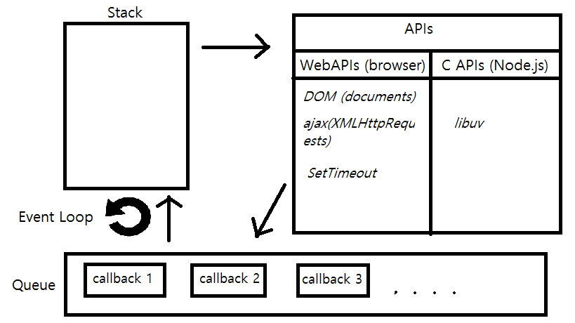
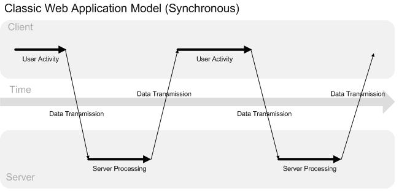
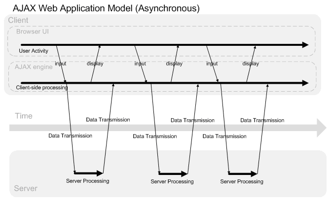

# Асинхронный JavaScript


### Отложенное (асинхронное) выполнение кода

 - `setTimeout(fn, delay)` - выполнить функцию `fn` не раньше чем через `delay` миллисекунд
 - `setInterval(fn, delay)` - выполнять функцию `fn` с интервалами не меньше `delay` миллисекунд

```javascript
console.log("start");

const timer1 = setTimeout(() => console.log("timer 1 fired"), 1000),
      timer2 = setTimeout(() => console.log("timer 2 fired"), 1000);

clearTimeout(timer2);

console.log("finish");

// "start"  (мгновенно)
// "finish" (мгновенно)
// "timer 1 fired" (через 1 с)
```


### Асинхронное выполнение кода

<pre><code data-trim data-noescape class="javascript">
console.log("script started");

// откладываем выполнение функции на полсекунды
setTimeout(() => console.log("timed out function"), 500);

const endDate = Date.now() + 1000;
while (Date.now() < endDate) ; // делаем "ничего" одну секунду

console.log("script finished");

// "script started"
// ? <span class="fragment">"script finished" (через 1 с)</span>
// ? <span class="fragment">"timed out function" (через 1 с)</span>
</code></pre>


### Цикл событий (event loop)



### Цикл событий (event loop)


### Асинхронное выполнение кода

 - JS - *однопоточный* язык с асинхронной обработкой событий
 - Главный цикл зашит глубоко внутри среды выполнения
 - При завершении асинхронной операции/возникновении события обработчик (*callback*) ставится в очередь на выполнение 
 - На каждой итерации цикла из очереди берется очередной кусок кода и выполняется синхронно


### Обработчики событий

<ul>
 <li>Сначала выполняются обработчики события, затем действие по умолчанию
     <ul>
         <li>Кнопка не "нажмется", пока не отработает обработчик клика</li>
         <li>Обработчик клика не запустится, пока стек/очередь не пусты</li>
         <li>"Тяжелые" вычисления блокируют весь UI браузера</li>
     </ul>
 </li>
 <li>Следует отдавать предпочтение асинхронным вызовам</li>
</ul>
<button onclick="let x = Date.now() + 1000; while (Date.now() < x) ; this.classList.toggle('red')" class="big-button fragment">I'm sync!</button>
<button onclick="setTimeout(() => this.classList.toggle('red'), 1000)" class="big-button fragment">I'm A-sync!</button>


### События и "задания"
 - Асинхронную "работу" можно разделить на два вида:
 - События (e.g. DOM: click, focus/blur etc.)
 - Задания, инициированные кодом (e.g. AJAX, WebWorkers, fs в NodeJS)
 - При выполнении заданий могут возникнуть ошибки
 - Часто нужно выполнить несколько заданий параллельно/последовательно


### Коллбеки (Callbacks)
 - *callback* - функция, которая вызовется после завершения асинхронной операции
 - Обработка ошибок при этом зависит от автора API
 
```javascript
function createImage(src, parent, callback) {
    const img = document.createElement("img");
    img.src = src;
    img.onload = callback;
    parent.appendChild(img);
}
```


### Callbacks
 - Что если наши вкусы очень специфичны?
 - Несколько независимых действий при завершении операции?
 - Несколько асинхронных операций параллельно?
 - Несколько асинхронных операций последовательно?
 - При этом корректно обработать всевозможные ошибки?
 - Коллбеки говорят нам на это: "Кто вы такие? Я вас не звал!"


### Callback Hell (Pyramid of Doom)

```javascript
apiRequest(param1, param2, function(err, apiResult) {
    if (err) { . . . }
    
    dbQuery(apiResult, function(err, queryResult) {
        if (err) { . . . }
        
        insertRow(queryResult, function(err) {
            if (err) { . . . }
            
            logSuccess(someParam, function(err) {
                if (err) { . . . }
            });
        });
    });
});
```


### Promises (класс `Promise`)
 - Абстракция над жизненным циклом асинхронной операции
 - В ожидании (Pending)
 - Выполнен (Fulfilled/Resolved)
 - Отклонен (Rejected)
 - Разрешен (Settled)
 


### Создание Promise
<div class="flex">
<pre><code class="javascript" data-trim data-noescape>
new Promise(function(resolve, reject) {
    __do_something_async__
    if ( __ok__ ) {
        resolve(someValue);
    } else {
        reject(someError);
    }
})
.then(function(someValue) { . . . })
.catch(function(someError) { . . . });
</code></pre>
<pre><code class="javascript" data-trim data-noescape>
new Promise(function(resolve, reject) {
    const img =
        document.createElement("img");
    img.src = src;
    img.onload = resolve;
    img.onerror = reject;
    document.body.appendChild(img);
})
.then(() => console.log("image loaded"))
.catch(() => console.log("load failed"));
</code></pre>
</div>

<pre><code class="javascript" data-trim data-noescape>
const wait = function(ms) {
    return new Promise(function(resolve) {
        setTimeout(resolve, ms);
    });
}

wait(1000).then(() => console.log("1 second"));
</code></pre>

 - Значение переданное в `resolve` попадет в `then()`
 - Значение переданное в `reject` попадет в `catch()`


### Цепочки Promise
 - Из `then/catch` мы можем:
 - Вернуть еще один `Promise`
 - Вернуть "синхронное" значение
 - Выбросить "синхронную" ошибку (`throw`)

<div class="flex">
<pre><code class="javascript" data-noescape data-trim>
apiRequest(p1, p2, function(err, apiRes) {
  if (err) { . . . }
  
  dbQuery(apiRes, function(err, queryRes) {
    if (err) { . . . }
    
    insertRow(queryRes, function(err) {
      if (err) { . . . }
      
      logSuccess(someParam, function(err) {
        if (err) { . . . }
      });
    });
  });
});
</pre></code>
<pre><code class="javascript" data-noescape data-trim>
apiRequest(param1, param2)
.then(apiResult => {
    // . . .
    // Очень важно не забывать про return!
    // Возвращаем новый Promise
    return dbQuery(apiResult);
}).then(queryResult => {
    // . . .
    return insertRow(queryResult);
}).then(() => {
    return logSuccess(someParam);
}).catch((e) => {
    // Handle error
});
</pre></code>
</div>


### Цепочки Promise

```javascript
getUserByName("qwerty").then(user => {
    
    if (user.isLoggedOut()) {
        // Выбрасываем синхронную ошибку
        throw new Error('user logged out!');
    }
    if (accountsCache[user.id]) {
        return accountsCache[user.id];    // Отдаем синхронное значение
    }
    return getUserAccountById(user.id); // Отдаем новый Promise
  
}).then(userAccount => {
  
    // Получили аккаунт пользователя
  
}).catch(function (err) {
    // Важно не забывать о catch, иначе сообщения об ошибках просто пропадут
});
```


### Другие возможности Promise

 - `Promise.resolve()` - возвращает заранее fulfilled промис
 - `Promise.reject()` - возвращает заранее rejected промис
 - `Promise.all()` - принимает массив промисов и возвращает новый, который выполнится только после выполнения всех промисов из списка

```javascript
fetchAllItems().then(items => {
    items.forEach(item => {
        fetchItemInfo(item.id);  
    });
}).then(function () {
  // На самом деле эта функция
  // вызовется еще до прихода первого ответа
});
```
```javascript
fetchAllItems().then(items => {
    return Promise.all(
        items.map(item => fetchItemInfo(item.id))
    );
}).then(arrayOfResults => {
    // Получаем все данные как только пришел последний ответ
});
```


### AJAX & Fetch
 - AJAX - технология обращения к серверу без перезагрузки страницы
 - Объект xhr (XMLHttpRequest) - старый API, основанный на колбеках
 - `Window.fetch()` - новый API, работающий на промисах

```javascript
fetch(url, {
    body: JSON.stringify(data),
    headers: {
      'content-type': 'application/json'
    },
    method: 'POST',
})
.then(response => response.json()) // Парсинг результата в JSON
```


### JSON
 - де-факто стандарт кодирования при передаче данных в AJAX
 - синтаксис для сериализации объектов, массивов, чисел, строк, логических значений и `null`
 - Подмножество JavaScript
 - Строки и имена свойств объектов должны быть в `" "`
 - `JSON.stringify()` - перевод данных JS в JSON-строку
 - `JSON.parse()` - перевод JSON-стрки в JS-данные

```javascript
const json = JSON.stringify({
    obj: {
        arr: [1, "false", false]
    },
    x: 15,
    undef: () => {}
});   // -> '{"obj":{"arr":[1,"false",false]},"x":15}'

JSON.parse(json); // -> {obj: { . . .}, x: 15}
```


### Эволюция web-приложений: long time ago

 - Классическая схема web-приложения не содержит JS вовсе
 - (1) Браузер делает HTTP-запрос на сервер
 - (2) Сервер генерирует HTML + CSS для браузера
 - Pros: простота, не требует JS
 - Cons: в каждом ответе дублируется часть разметки
 - Сервер отвечает за создание HTML (сервер это не любит)




### Эволюция web-приложений: эра AJAX

 - клиентский JS запрашивает отдельные данные или части страницы
 - Pros: <ul>
    <li> - уменьшает нагрузку на сервер</li>
    <li> - уменьшает передаваемый объем данных (при длительной работе)</li>
    <li> - улучшает UI/UX ("отзывчивый интерфейс")</li>
    <li> - может использовать любые методы и кодировки HTTP</li>
 </ul>
 - Cons: <ul>
    <li> - начальная загрузка страницы занимает больше времени</li>
    <li> - код клиента и сервера усложняется</li>
    <li> - построение HTML-разметки дублируется на сервере и клиенте</li>
 </ul>


### Эволюция web-приложений: AJAX




### Эволюция web-приложений: SPA

 - Single Page Application (SPA) - web-приложение, в котором вся логика генерации и отображения HTML содержится в JS
 - сервер отвечает только за хранение и обработку данных
 - страница никогда не перезагружается
 - данные передаются в формате JSON
 - Pros: <ul>
    <li> - сервер освобождается от задачи генерации HTML</li>
    <li> - один сервер может работать с любыми клиентами</li>
    <li> - наилучший UI/UX из возможных</li>
 </ul>
 - Cons:<ul>
    <li> - не работают с отключенным JS</li>
    <li> - перед началом работы нужно загрузить большой объем JS-кода</li>
 </ul>


### Эволюция web-приложений


