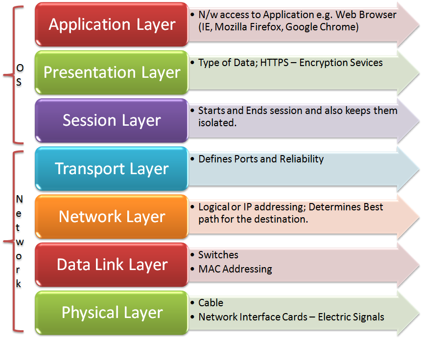
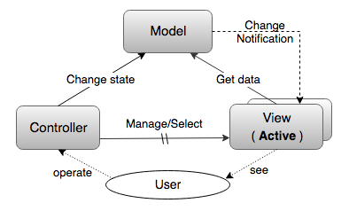
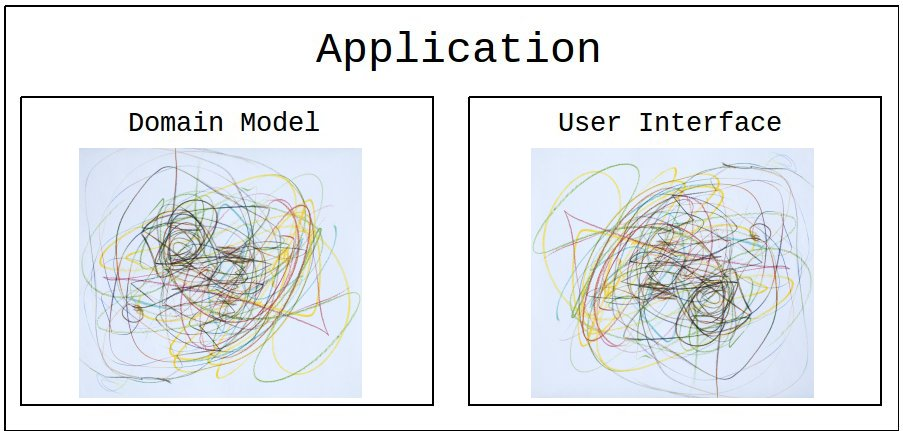
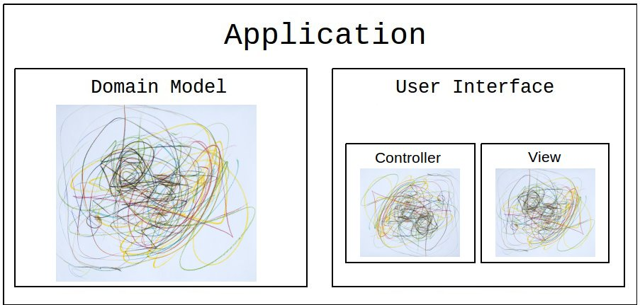

# HTTP
# REST
# MVC


### Модель OSI




### HTTP 1.0/1.1
 - HyperText Transfer Protocol
 - Протокол "Запрос/Ответ" (Request/Response)
 - Текстовый (HTTP/2 - уже бинарный)
 - Не хранит состояние (stateless)


### Запрос HTTP

```
<Метод HTTP> <URI> HTTP/<версия>
<Имя заголовка>: <значение заголовка>
<Имя заголовка>: <значение заголовка>
. . .
(пустая строка)
<тело запроса>
```

```HTTP
GET /article?id=12 HTTP/1.1
Host: mysite.com

```

```HTTP
POST /contact_form.php HTTP/1.1
Host: developer.mozilla.org
Content-Length: 64
Content-Type: application/x-www-form-urlencoded

name=Joe%20User&request=Send%20me%20one%20of%20your%20catalogue
```

```HTTP
PUT /data HTTP/1.1
Host: mysite.com
Content-Length: 65
Content-Type: application/json

{"key1":"value1","key2":"value2","number1":1234,"arr":[1,2,"a"]}
```


### Ответ HTTP

```
HTTP/<версия> <Код ответа> <Описание кода>
<Имя заголовка>: <значение заголовка>
<Имя заголовка>: <значение заголовка>
. . .
(пустая строка)
<тело ответа>
```

```HTTP
HTTP/1.1 200 OK
Last-Modified: Tue, 01 Dec 2009 20:18:22 GMT
Content-Length: 29769
Content-Type: text/html

<!DOCTYPE html... (29769 bytes of the requested web page)
```

```HTTP
HTTP/1.1 404 Not Found
Content-Length: 10732
Content-Type: text/html

<!DOCTYPE html... (site-customized 404 page)
```


### HTTP 1.0 vs 1.1

 - HTTP 1.1 поддерживает virtual hosts (заголовок `Host`)
 - HTTP 1.1 поддерживает keep-alive соединения (`Connection: keep-alive`)


### Методы HTTP (verbs)
 - `Safe` - не изменяет состояние сервера
 - `Idempotent` - повторный запрос будет иметь точно такой же результат
 - `Cacheable` - может ли браузер закешировать ответ
 
<table>
<tr>
    <td>Метод</td>
    <td>Описание</td>
    <td>Safe</td>
    <td>Idempotent</td>
    <td>Cacheable</td>
</tr>
<tr>
    <td>GET</td>
    <td>Получить значение ресурса</td>
    <td>✔</td>
    <td>✔</td>
    <td>✔</td>
</tr>
<tr>
    <td>HEAD</td>
    <td>Получить те же заголовки что выдал бы GET, но без тела ответа</td>
    <td>✔</td>
    <td>✔</td>
    <td>✔</td>
</tr>
<tr>
    <td>POST</td>
    <td>Послать данные на сервер</td>
    <td>-</td>
    <td>-</td>
    <td>-</td>
</tr>
<tr>
    <td>PUT</td>
    <td>Создать или полностью обновить данные ресурса</td>
    <td>-</td>
    <td>✔</td>
    <td>-</td>
</tr>
<tr>
    <td>PATCH</td>
    <td>Обновить часть данных ресурса</td>
    <td>-</td>
    <td>-</td>
    <td>-</td>
</tr>
<tr>
    <td>DELETE</td>
    <td>Удалить ресурс</td>
    <td>-</td>
    <td>✔</td>
    <td>-</td>
</tr>
</table>


### Cookies
 - `Cookie` - небольшой кусок данных, посылаемый сервером при ответе на HTTP запрос
 - Браузер посылает сохраненные cookies со следующими запросами к серверу
 - Используются для управления сессиями, персонализации, трекинга поведения пользователя

```HTTP
HTTP/1.0 200 OK
Content-type: text/html
Set-Cookie: id=a3fWa; Expires=Wed, 21 Oct 2015 07:28:00 GMT; HttpOnly
Set-Cookie: yummy_cookie=choco
Set-Cookie: tasty_cookie=strawberry
```

```HTTP
GET /sample_page.html HTTP/1.1
Host: www.example.org
Cookie: yummy_cookie=choco; tasty_cookie=strawberry; id=a3fWa
```


### `localStorage` & `sessionStorage`

 - `localStorage` - хранилище данных в формате "ключ-значение". Данные хранятся неограниченно долго
 - `sessionStorage` - то же что и `localStorage`, но данные хранятся на протяжении сессии

```javascript
localStorage.setItem("key", "value");
let data = localStorage.getItem("key");
localStorage.removeItem("key");
localStorage.clear();
```


### Cookies vs `localStorage` vs `sessionStorage`

<table>
<tr>
    <td></td>
    <td>Cookies</td>
    <td>localStorage</td>
    <td>sessionStorage</td>
</tr>
<tr>
    <td>Кто устанавливает</td>
    <td>Сервер (клиент*)</td>
    <td>Клиент</td>
    <td>Клиент</td>
</tr>
<tr>
    <td>Кто читает</td>
    <td>Сервер (клиент*)</td>
    <td>Клиент</td>
    <td>Клиент</td>
</tr>
<tr>
    <td>Размер хранилища</td>
    <td>~180 * 4Kb</td>
    <td>~5-10Mb</td>
    <td>~5-10Mb</td>
</tr>
<tr>
    <td>Срок жизни</td>
    <td>Настраивается</td>
    <td>Вечно</td>
    <td>Сессия</td>
</tr>
<tr>
    <td>Что хранить?</td>
    <td>Данные для сервера</td>
    <td>Любые некритичные данные для клиента</td>
    <td>Любые некритичные данные для клиента</td>
</tr>
</table>


### RESTful API

 - Стиль написания серверного API, использующий *семантику* HTTP
 - Клиент-Сервер: REST подразумевает клиент-серверную архитектуру 
 - `Stateless`: сервер не сохраняет никакого состояния между двумя запросами. Каждый запрос содержит полную информацию о нужном действии.
 - `Cacheable`: сервер сообщает клиенту информацию о возможности кеширования

```HTTP
POST /article-add.php

<article info>

GET /delete-article.php?id=17&action=DELETE

POST /deleteMyComment/13?userId=4
```


### RESTful API
 - URL представляет *ресурс* - объект системы (необязательно соответствующий данным в БД)
 - Метод HTTP описывает действие над ресурсом
 - Код ответа сервера описывает выполненное действие
 - `Content-type` задает формат данных (обычно JSON/XML)


### RESTful API

<table>
<tr>
    <td>Запрос</td>
    <td>Действие</td>
    <td>Код ответа</td>
</tr>
<tr>
    <td>`GET /articles`</td>
    <td>Получить список статей</td>
    <td>200 OK</td>
</tr>
<tr>
    <td>`GET /articles?limit=10&offset=20`</td>
    <td>Получить список статей</td>
    <td>200 OK</td>
</tr>
<tr>
    <td>`GET /articles/count`</td>
    <td>Получить общее число статей</td>
    <td>200 OK</td>
</tr>
<tr>
    <td>`POST /articles`</td>
    <td>Добавить новую статью</td>
    <td>200 OK/201 Created</td>
</tr>
<tr>
    <td>`GET /articles/15`</td>
    <td>Получить статью</td>
    <td>200 OK</td>
</tr>
<tr>
    <td>`HEAD /articles/15`</td>
    <td>Проверить существование</td>
    <td>200 OK</td>
</tr>
<tr>
    <td>`PUT /articles/15`</td>
    <td>Обновить статью</td>
    <td>200 OK/204 No Content</td>
</tr>
<tr>
    <td>`PATCH /articles/15`</td>
    <td>Обновить часть статьи</td>
    <td>200 OK/204 No Content</td>
</tr>
<tr>
    <td>`DELETE /articles/15`</td>
    <td>Удалить статью</td>
    <td>200 OK/202 Accepted/204 No Content</td>
</tr>
</table>


### RESTful API

```HTTP
GET http://oursite.com/v1/users.json
```

```JSON
{
    "data": [
        { id: 1, name: "...", ... },
        { id: 4, name: "...", ... },
        ...
    ],
    "metadata": {
        "code": 200,
        "codeDescr": "OK",
        "count": 3076,
        "user_url": "v1/users/{id}",
        "user_avatar": "v1/users/{id}/avatar"
    }
}
```


### MVC

 - `MVC` - архитектурный паттерн для приложений с UI
 - Разделяет компонент на три взаимосвязанных части




### Проблемы в понимании MVC

 - Огромное число вариантов реализации (стрелочки на схеме можно нарисовать почти как угодно!)
 - Отсюда появляются дополнительные названия `MVP/MVVM/MVA/Model2/MV*`
 - Искаженные или упрощенные описания MVC в литературе
 - Отсюда - огромное число заблуждений и неверных трактовок MVC
 - Следствие: описывать MVC как *паттерн* с жесткой схемой нет смысла


### MVC
  - `MVC` - набор архитектурных идей/принципов/подходов
  - Система должна разбиваться на модули, *слабо связанные друг с другом*
  - Шаг 1: разбиение системы на бизнес-логику (Domain Model) и UI (M-VC)
  - Шаг 2: Model реализует паттерн `Observer` (но не всегда)
  - Шаг 3: UI разбивается на Controller и View (но это не обязательно)


### Схема приложения без архитектуры


### M-VC
 - Шаг 1: разбиение системы на бизнес-логику (Domain Model) и UI (M-VC)
 - Model и UI - разные области и могут разрабатываться отдельно
 - Можно использовать несколько разных View с одной и той же Model
 - Model можно покрыть Unit-тестами (а не e2e тестами)
 - Model - **это не просто данные!!!** это данные и бизнес-логика
 - Model не должна содержать логику и данные UI
 - UI не должен содержать ни капли бизнес-логики


Note: логика First Name + Second Name в модели


### M-VC
 - Шаг 2: для слабой связанности Model реализует паттерн `Observer`
 - Модель рассылает извещения об изменениях
 - UI подписывается на изменения и узнаёт когда нужно обновиться
 - Модель ничего не знает о UI, и даже о его существовании

```javascript
// Без Observer
class ToDoModel {
    constructor(view) {
        this.view = view;
        this.list = [];
    }
    getList() {
        return list;
    }
    add(text) {
        this.list.push({ text, complete: false });
        this.view.notify();
        // А что если нам нужно несколько View?
        // А что если у нас пока что нет ни одного View?
    }
}
```


### `Observer`
<div class="flex">
<pre><code class="javascript" data-trim data-noescape>
// Простейший observer
class Subject {
  constructor() {
    this.observers = [];
  }    
  add(item) {
    this.observers.push(item);
  }
  removeAll() {
    this.observers = [];
  }
  notifyObservers() {
    for (elem of this.observers) {
      elem.notify();
    }
  }
}
</code></pre>
<pre><code class="javascript" data-trim data-noescape>
class ToDoModel {
  constructor() {
    <mark>this.subject = new Subject();</mark>
    this.list = [];
  }
  getList() { return this.list; }
  add(text) {
    this.list.push({ 
      text, complete: false
    });
    <mark>this.subject.notifyObservers();</mark>
  }
  complete: function(index, isComplete) {
    this.list[index].complete = !!isComplete;
    <mark>this.subject.notifyObservers();</mark>
  }
  // observer
  <mark>register(...args) {
    for (const elem of args) {
      this.subject.add(elem);
    }
  }</mark>
}
</code></pre>
</div>


### M-V-C
 - Шаг 3: UI разбивается на Controller и View
 - Вид отображает модель
 - Контроллер реагирует на действия пользователя и вызывает методы модели
 - Второй уровень декомпозиции, почти всегда пропускается в FE-фреймворках

