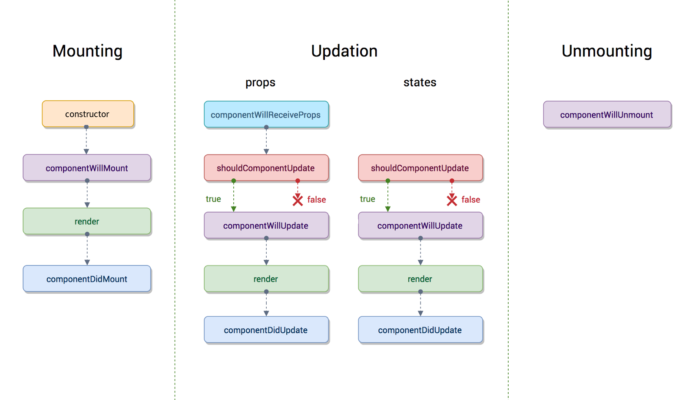

# React


### Особенности React
 - "VC" in "MVC". Это только *библиотека рендеринга*
 - Компонентный подход
 - JSX
 - Virtual DOM
 - "One-way" Data Flow


### JSX
 - Синтаксис, позволяющий добавить разметку прямо в js-код
 - JSX - выражение; в JSX можно добавить другие js-выражения
 - Позволяет разделять код не по *технологиям*, а по *задачам*
 - Синтаксический сахар над `React.createElement()`

```javascript
const element = <h1>Hello, {formatName(user)}!</h1>;

function getGreeting(user) {
  return user
    ? <h1>Hello, {formatName(user)}!</h1>
    : <h1>Hello, Stranger.</h1>;
}
```

<div class="flex" style="margin-top: -2rem;">
<pre><code class="javascript" data-trim data-noescape>
class Hello extends React.Component {
 render() {
  return &lt;div&gt;Hello {this.props.who}&lt;/div&gt;;
 }
}

ReactDOM.render(
  &lt;Hello who="World" /&gt;, document.body
);
</code></pre>
<pre><code class="javascript" data-trim data-noescape>
class Hello extends React.Component {
 render() {
  return React.createElement(
   "div", null, "Hello ", this.props.who);
 }
}
ReactDOM.render(
 React.createElement(Hello, {who: "World"}),
 document.body);
</code></pre>
</div>


### Элементы
 - Элемент - самый мелкий строительный блок React
 - Элементы неизменяемы: отдельный элемент UI в отдельный элемент времени

<div class="flex">
<pre><code class="javascript" data-trim data-noescape>
function tick() {
  const element = (
    &lt;div&gt;
      &lt;h4&gt;Hello, world!&lt;/h4&gt;
      &lt;h5&gt;It is
        {new Date().toLocaleTimeString()}.
      &lt;/h5&gt;
    &lt;/div&gt;
  );
  ReactDOM.render(
    element,
    document.getElementById("root")
  );
}

setInterval(tick, 1000);
</code></pre>
<div id="react-element-example" class="fragment" style="padding-top: 5%;"></div>
</div>


### Virtual DOM
 - *Virtual DOM (VDOM)* - структура данных, уровень абстракции над UI
 - Операции с VDOM очень быстрые (в отличие от DOM)
 - При каждом изменении React проверяет какие части VDOM изменились (reconciliation)
 - Перерисовываются (re-render) только измененные части DOM
 - *Позволяет писать UI (HTML) как функцию от состояния*


### Компоненты
 - Компонент - отдельный, независимый, переиспользуемый элемент UI
 - Может содержать в себе другие компоненты (композиция)
 - Концептуально это функция, возвращающая элемент UI


### Компоненты
 - Stateless (functional) component - обычная функция
 - Атрибуты JSX попадают в отдельный объект - `props`
 - Имя компонента должно начинаться с заглавной буквы
 - Properties *не должны изменяться* (read-only)
 
```javascript
function Welcome(props) {
  return <h1>Hello, {props.name}</h1>;
}

ReactDOM.render(
  <Welcome name="Sara" />,
  document.getElementById("root")
);
```


### Композиция компонентов

<div class="flex" >
<pre><code class="javascript" data-trim data-noescape>
function Comment(props) {
  return (
    &lt;div className="Comment"&gt;
      &lt;div className="UserInfo"&gt;
        &lt;img className="Avatar"
          src={props.author.avatarUrl}
          alt={props.author.name}
        /&gt;
        &lt;div className="UserInfo-name"&gt;
          {props.author.name}
        &lt;/div&gt;
      &lt;/div&gt;
      &lt;div className="text"&gt;
        {props.text}
      &lt;/div&gt;
    &lt;/div&gt;
  );
}
</code></pre>
<div>
<pre><code class="javascript" data-trim data-noescape>
const Avatar = (props) => (
  &lt;img className="Avatar"
    src={props.user.avatarUrl}
    alt={props.user.name}
  /&gt;
);
</code></pre>
<pre><code class="javascript" data-trim data-noescape>
const UserInfo = (props) => (
  &lt;div className="UserInfo"&gt;
    &lt;Avatar user={props.user} /&gt;
    &lt;div className="UserInfo-name"&gt;
      {props.user.name}
    &lt;/div&gt;
  &lt;/div&gt;
);
</code></pre>
<pre><code class="javascript" data-trim data-noescape>
const Comment = (props) => (
  &lt;div className="Comment"&gt;
    &lt;UserInfo user={props.author} /&gt;
    &lt;div className="Comment-text"&gt;
      {props.text}
    &lt;/div&gt;
  &lt;/div&gt;
);
</code></pre>
</div>
</div>


### Stateful компоненты
 - Класс, наследующийся от `React.Component` и реализующий метод `render()`

<div class="flex">
<pre><code class="javascript" data-trim data-noescape>
const Clock = (props) => (
  &lt;div&gt;
    &lt;h1&gt;Hello, world!&lt;/h1&gt;
    &lt;h2&gt;
      It is {props.date.toTimeString()}.
    &lt;/h2&gt;
  &lt;/div&gt;
);

function tick() {
  ReactDOM.render(
    &lt;Clock date={new Date()} /&gt;,
    document.getElementById("root")
  );
}

setInterval(tick, 1000);
</code></pre>
<pre><code class="javascript" data-trim data-noescape>
class Clock extends React.Component {
  <mark>render() {</mark>
    return (
      &lt;div&gt;
        &lt;h1&gt;Hello, world!&lt;/h1&gt;
        &lt;h2&gt;It is
          {<mark>this.</mark>props.date.toTimeString()}.
        &lt;/h2&gt;
      &lt;/div&gt;
    );
  }
}

function tick() {
  ReactDOM.render(
    &lt;Clock date={new Date()} /&gt;,
    document.getElementById("root")
  );
}
setInterval(tick, 1000);
</code></pre>
</div>


### Stateful компоненты

<div class="flex">
<pre><code class="javascript" data-trim data-noescape>
class Clock extends React.Component {
  constructor(props) {
    super(props);
    this.<mark>state</mark> = { date: new Date() };
  }

  render() {
    return (
      &lt;div&gt;
        &lt;h1&gt;Hello, world!&lt;/h1&gt;
        &lt;h2&gt;It is
          {this.<mark>state</mark>.date.toTimeString()}.
        &lt;/h2&gt;
      &lt;/div&gt;
    );
  }
}

ReactDOM.render(
  &lt;Clock <mark> </mark> /&gt;,
  document.getElementById("root")
);
</code></pre>
<pre><code class="javascript" data-trim data-noescape>
class Clock extends React.Component {
  constructor(props) {
    super(props);
    this.state = { date: new Date() };
  }

  componentDidMount() {
    this.timerID = setInterval(
      () => this.tick(), 1000
    );
  }

  componentWillUnmount() {
    clearInterval(this.timerID);
  }

  tick() {
    this.setState({ date: new Date() });
  }

  render() { ... }
}
</code></pre>
</div>


### `.state` и `setState()`
 - В `state` находятся данные, участвующие в `render()`
 - `state` обновляется *только* через `setState`
 - `setState()` работает асинхронно
 - `setState()` производит слияние изменений в `state`

```javascript
// Неправильно
this.setState({
  counter: this.state.counter + this.props.increment
});

// Правильно
this.setState((prevState, props) => ({
  counter: prevState.counter + props.increment
}));
```


### `state`, `props` и прочие ~~неприятности~~ данные класса
 - `props` - read-only "параметры" компонента, поступают извне
 - `state` - состояние компонента, изменяется через `setState`
 - При изменении `props` и `state` React вызывает `render()` компонента
 - Остальные данные - обычные свойства компонента

```javascript
class CustomButton extends React.Component {
  constructor(props) {
      super(props);
      this.state = { active: false };
  }
}

CustomButton.defaultProps = {
  color: "blue"
};

<CustomButton />
// CustomButton с this.props.color === "blue"
```


### Жизненный цикл компонента




### События

 - Обработчики прописываются прямо в JSX
 - Обычно обработчик - это метод компонента
 - В обработчик передается `SyntheticEvent` - обертка над событием браузера

<pre><code class="javascript" data-trim data-noescape>
class Toggle extends React.Component {
  constructor(props) {
    super(props);
    this.state = { label: "OFF" };
    this.handleClick = this.handleClick.<mark>bind</mark>(this);
  }
  
  handleClick() {
    this.setState(prevState => ({
      label: prevState.label === "OFF" ? "ON" : "OFF"
    }));
  }
  
  render() {
    return &lt;button onClick={this.handleClick}&gt;{this.state.label}&lt;/button&gt;;
    // {e => this.handleClick(e)} или {this.handleClick.bind(this)}
  }
}
</code></pre>


### JSX посложнее
 - JSX позволяет смешивать JS-код и разметку:
 - Вывод того или иного элемента по условию
 - Вывод списков с помощью `map`
 - Ключи (`keys`) помогают отслеживать изменения элементов массива
 - Ключ - уникальный id элемента в *контексте этого списка*

<pre><code class="javascript" data-trim data-noescape>
function NumberList(props) {
  return (
    &lt;ul&gt;{ props.numbers.map((number) =>
      &lt;li key={number.toString()}&gt;
        {number}
      &lt;/li&gt;) }
    &lt;/ul&gt;
  );
}

&lt;NumberList numbers={[1, 2, 3, 4, 5]} /&gt;
</code></pre>


### Формы
<div class="flex">
<pre><code class="javascript" data-trim data-noescape>
class MyForm extends React.Component {
  constructor(props) {
    super(props);
    
    this.state = {
      textValue: "",
      textareaValue: "",
      selectValue: []
    };
    
    this.handleInputChange =
      this.handleInputChange.bind(this);
  }

  handleInputChange(e) {
    this.setState({
      [e.target.name]: value
    });
  }
</code></pre>
<pre><code class="javascript" data-trim data-noescape>
  render() {
    return (
      &lt;form>
        &lt;input name="textValue"
          type="text"
          value={this.state.textValue}
          onChange={this.handleInputChange} /&gt;
        
        &lt;textarea name="textareaValue"
          value={this.state.textareaValue}
          onChange={this.handleInputChange} /&gt;
        
        &lt;select name="selectValue"
          multiple={true}
          value={selectValue}
          onChange={this.handleInputChange}&gt;
          &lt;option value="1"&gt;1&lt;/option&gt;
          . . .
        &lt;/select&gt;
      &lt;/form&gt;
    );
  }
}
</code></pre>
</div>


### Совместный доступ к данным
 - Часто разные компоненты используют одни и те же данные
 - React предлагает хранить такие данные в `state` родителя

<div class="flex">
<pre><code class="javascript" data-trim data-noescape>
class App extends React.Component {
  constructor(props) {
    super(props);
    this.state = { temp: 0 };
  }
  onChange(temp) {
    this.setState({ temp: Number(temp) });
  }
  render() {
    return (
      &lt;div className="App"&gt;
        &lt;TemperatureInput
          temp={this.state.temp}
          onChange=
            {this.onChange.bind(this)} /&gt;
        &lt;BoilingVerdict
            temp={this.state.temp} /&gt;
      &lt;/div&gt;
    );
  }
}
</code></pre>
<pre><code class="javascript" data-trim data-noescape>
const TemperatureInput = props => (
  &lt;input value={props.temp}
         onChange={e =>
            props.onChange(e.target.value)}
  /&gt;
);

const BoilingVerdict = props =>
  (props.temp >= 100)
    ? &lt;p>The water would boil.&lt;/p&gt;
    : &lt;p>The water would not boil.&lt;/p&gt;;
</code></pre>
</div>


### Композиция компонентов
 - Часто компонент служит "оберткой" для других компонентов
 - Вся JSX-разметка которая находится внутри тегов компонента, попадает в специальное свойство `props.children`
 
<div class="flex">
<pre><code class="javascript" data-trim data-noescape>
const FancyBorder = props => (
  &lt;div
    className={"FBorder-" + props.color}>
    {props.children}
  &lt;/div&gt;
);

const WelcomeDialog = props => (
  &lt;FancyBorder color="blue"&gt;
    &lt;h1 className="Dialog-title"&gt;
      Welcome
    &lt;/h1&gt;
    &lt;p className="Dialog-message"&gt;
      Thank you for visiting us!
    &lt;/p&gt;
  &lt;/FancyBorder&gt;
);
</code></pre>
<pre><code class="javascript" data-trim data-noescape>
const SplitPane = props => (
  &lt;div className="SplitPane"&gt;
    &lt;div className="SplitPane-left"&gt;
      {props.left}
    &lt;/div&gt;
    &lt;div className="SplitPane-right"&gt;
      {props.right}
    &lt;/div&gt;
  &lt;/div&gt;
);

&lt;SplitPane
  left={&lt;Contacts /&gt;}
  right={&lt;Chat /&gt;}
/&gt;
</code></pre>
</div>


### `propTypes`
 - Простой способ добавить проверку типов `props`, которые поступают в компонент

```javascript
import PropTypes from 'prop-types';

class Greeting extends React.Component {
  render() {
    return (
      <h1>Hello, {this.props.name}</h1>
    );
  }
}

Greeting.propTypes = {
  name: PropTypes.string
};
```